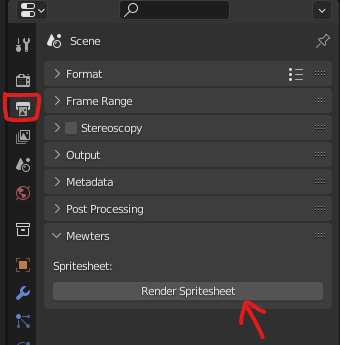
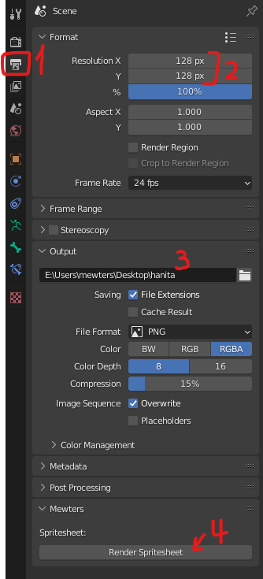
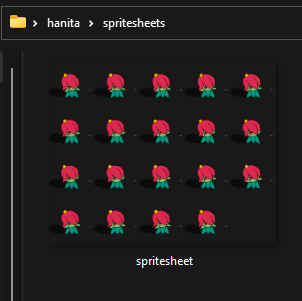
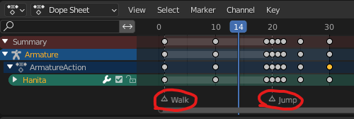
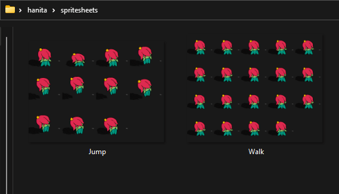

# Blender Render Spritesheet

This Blender plugin allows you to render the selected frames on the timeline and generate a spritesheet with these frames.

You can define names for each spritesheet using markers on the timeline

Compatible with 3D and Grease Pencil

## Requirements:
- [Blender](https://blender.org/) (version 2.90 or higher)
- [ImageMagick](https://imagemagick.org/) (for generating the spritesheet images)

## Instalation

1. Download the [render-spritesheet-addon.py](https://raw.githubusercontent.com/mewters/blender-render-spritesheet/main/render-spritesheet-addon.py) file from this GitHub repository
1. In Blender, go to Edit > Preferences > Add-ons
1. Click on "Install" and select the downloaded `render-spritesheet-addon.py` file
1. Enable the add-on by clicking on the checkbox next to its name
1. You will now see a new `Render Spritesheet` button in the `Output Properties`
    - 

## Usage:

1. Go to `Output Properties` Menu
1. Set the size of each frame
1. Set the output directory
1. Click on the `Render Spritesheet` button

You'll got a `spritesheets` folder with a `spritesheet.png` file:

## Named spritesheets for multiple actions

You can export multiple spritesheets with actions names very easily.

1. Add markers on the timeline and name them as you wish (these names will be used to name the generated spritesheets)
    - 
1. Click on the `Render Spritesheet` button. The result will be files with the name of the markers from the timeline
    -    
